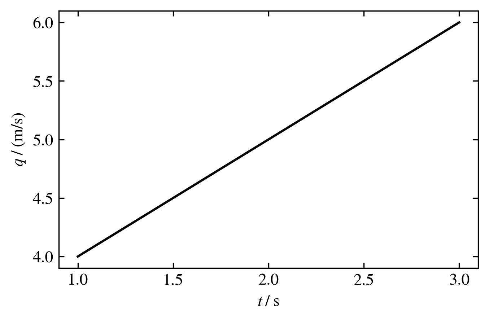
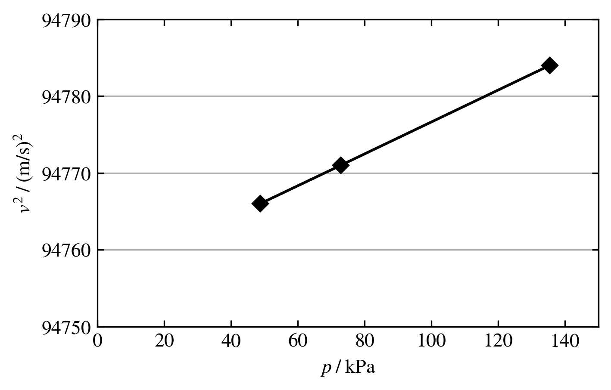

Usage
=====

Basic
-----
The most common usage pattern, and especially for interactive sessions, is to import
the predefined units:

>>> from unit_system import *
>>> Rsense = 10.0*mΩ
>>> Rsense
0.01 Ω
>>> Rsense.to('mΩ')
10.0 mΩ

>>> Is = 10*A
>>> Is*Rsense
0.1 V

Temperature in Celsius has to be entered using:

>>> Ta = Quantity(23, "°C")

since the '°' symbol's unicode value lies outside the acceptable range for Python
variable names.

Temperature differences are expressed in kelvin:

>>> dV = 1*V
>>> dT = 1*K
>>> tempco = dV/dT
>>> tempco
1.0 kg*m**2/(A*K*s**3)
>>> tempco.to('V/K')
1.0 V/K

Arrays can be created:

>>> import numpy as np
>>> f = np.logspace(0, 1, 2)*Hz
>>> f.to("Hz")
[ 1. 10.] Hz

You can convert from a non-SI unit into the SI equivalent, but it is a one-way trip.

>>> from unit_system import convert
>>> Ta = convert(72, '°F')
>>> Ta
295.37 K
>>> Ta.to('°C')
22.22 °C

Matplotlib
----------
`Matplotlib`_ offers a units interface where a custom class, such as Quantity, can be
registered allowing matplotlib to perform operations as defined by that custom class.
Normally, the default axis labels in matplotlib are set to ``None``, but
in the case of Quantity, the default axis labels are based on the unit. For example:

>>> import matplotlib.pyplot as plt
>>> from unit_system import *
>>> x = [0, 1, 2]*s
>>> y = [4, 5, 6]*m/s
>>> plt.plot(x, y)
>>> plt.show()

It is possible to change the units:

>>> x = [0, 0.01, 0.02]*s
>>> y = [0.04, 0.05, 0.06]*m/s
>>> plt.plot(x, y, xunits="ms", yunits="mm/s")
>>> plt.show()

It is possible to update the quantity symbol in the axis label:

>>> x = [0, 0.01, 0.02]*s
>>> y = [0.04, 0.05, 0.06]*m/s
>>> plt.plot(x, y, xunits="ms", yunits=("v_i", "m/s")
>>> plt.show()

In this graph, the x-axis is labeled '*t* / s' where '*t*' is the standard quantity
symbol for time and 's' is the unit symbol for the unit seconds. The label is
consistent with the BIPM recommendation discussed in the `SI Brochure`_ section
5.4.1 where the label is a mathematical expression. A particular number on the axis,
such as 2.0, is then read as 2.00 = *t* / s, or *t* = 2.0 s. On the y-axis, the *q*
here is just a generic quantity symbol. It can be replaced by updating the qsym
attribute of the Quantity as shown in the following example that reproduces the graph
in section 5.4.1 of the SI Brochure.

>>> import matplotlib.pyplot as plt
>>> from unit_system import *
>>> kPa = Quantity(1e3, "Pa")
>>> x = [48.73, 72.87, 135.42]*kPa
>>> x.to("kPa")
[ 48.73  72.87 135.42] kPa
>>> x.qsym = "p"
>>> y = [94766, 94771, 94784]*(m/s)**2
>>> y.to("(m/s)**2")
[94766. 94771. 94784.] (m/s)**2
>>> y.qsym = "v^2"
>>> fig, ax = plt.subplots()
>>> ax.plot(x, y, "Dk-")
[<matplotlib.lines.Line2D object at 0x...>]
>>> ax.set_xlim(0, 150)
(0, 150)
>>> ax.set_ylim(94750, 94790)
(94750, 94790)
>>> ax.set_yticks(range(94750, 94800, 10))
[<matplotlib.axis.YTick object at 0x...]
>>> plt.show()

Default label style
~~~~~~~~~~~~~~~~~~~

The default label style described above is different than the style commonly
used in technical publications where the axis label is considered arbitrary caption text
with the units shown in parentheses. It is possible to use this style by changing
the ``matplotlib_label_style`` option from ``si`` to ``caption`` in the
``unit_system.ini`` file located in the ``.unit_system`` folder in the user's
home directory.

Notes
-----
- Ω is ALT+234
- µ is ALT+230
- ° is ALT+248
- day has unit symbol d that conflicts with candela symbol cd and is not supported

.. _Matplotlib: https://github.com/matplotlib/matplotlib
.. _SI Brochure: https://www.bipm.org/en/publications/si-brochure/